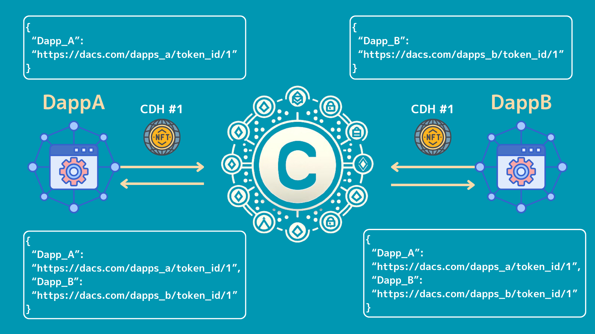
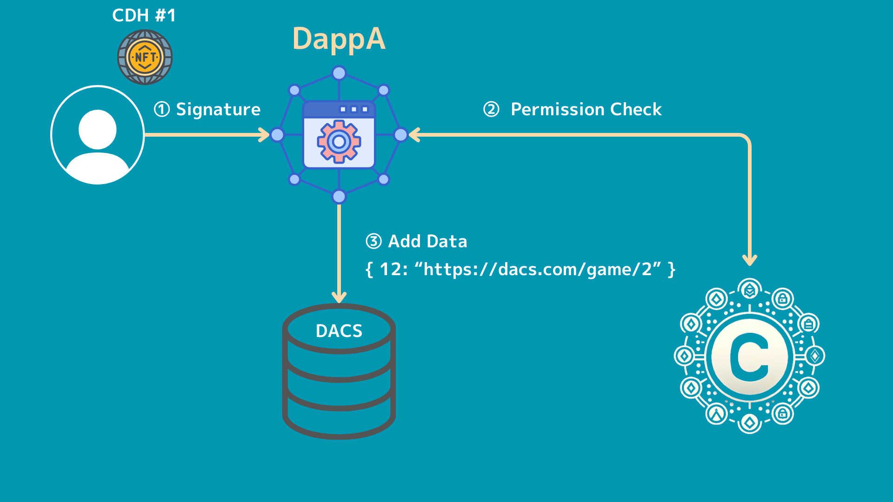
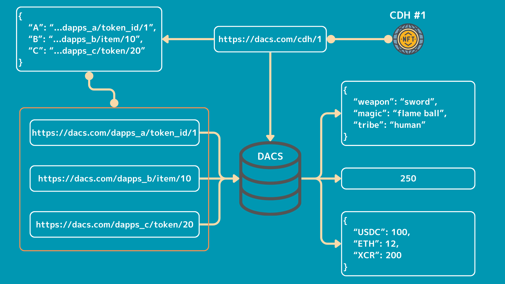

# CVCIP-1: Central Data Hub (CDH)

NFT to manage all data in one place.

## Abstract

NFT contract to manage all data in one place.
Various data can be placed in on-chain storage called "DACS" in the Cross Value Chain.
This data can be managed in conjunction with the NFT and can be changed as desired by the NFT holder or Dapps.
The NFT can also be used in various Dapps by storing metadata and URLs of the data stored in the various "DACS" in the contract.
This allows the CDH to act as a centre of excellence for data, making it mutually accessible between Dapps.

## Motivation

The NFT metadata used in Ethereum and elsewhere contains only limited data, such as "name", "description" and "image".
The NFT metadata used by Ethereum and other NFTs contains very little data such as "name", "description" and "image".
Some NFTs allow customisation of metadata freely, but they are only aware of the marketplaces such as Opensea, and do not make full use of the metadata.
Extending this metadata to define a variety of fields will broaden the use of NFTs.
The Cross Value Chain natively supports the on-chain storage "DACS" as a chain, which allows a variety of data to be placed here.
Details on how to access this data could not be read from the documentation, but we believe it can probably be accessed via a URL, for example.
By defining several pieces of data in the metadata, with the URL as the value and the key as the field name, it is possible to manage various types of data in the metadata.
For example, suppose you have Dapps_A and Dapps_B.
If specific data is stored in "DACS" for each address in each of these Dapps, it is possible to create fields "Dapps_A" and "Dapps_B" in the CDH metadata and have each Dapps retrieve data via the CDH.
It is also possible to access data from Dapps_A to Dapps_B and from Dapps_B to Dapps_A, thus facilitating interaction between Dapps.
In this way, the various Dapps use the CDH as a hub for exchanging data, making the chain more active and enjoyable for participating users and enabling developers to build a wider variety of applications.

For example, suppose there are **Dapps_A** and **Dapps_B\***.
If specific data is stored in "DACS" for each address in each of these Dapps, it would be possible to create fields "Dapps_A" and "Dapps_B" in the CDH metadata and retrieve the data from each Dapps via the CDH.

```json
{
  "Dapps_A": "https://dacs.com/dapps_a/token_id/1",
  "Dapps_B": "https://dacs.com/dapps_b/token_id/10"
}
```

It also facilitates interaction between Dapps by allowing **Dapps_A** to access data from **Dapps_B** and **Dapps_B** to access data from **Dapps_A**.
In this way, the various Dapps use the CDH as a hub to exchange data, making the chain more active and enjoyable for participating users and enabling developers to build a wider variety of applications.



## Specification

Only the holder of the NFT or an address authorised by the holder can add or update metadata.
The procedure for adding and updating is as follows.

1. send the fields, values and tokenId to be added to the metadata to the CDH contract.
2. access DACS from the CDH contract and check whether the executing address is authorised to add or update data
3. after the authorisation has been confirmed, write the data to DACS.



Within the metadata associated with each NFT, various fields are defined, the values of which are all URLs to data stored in DACS.
The structure is such that the data exists at the destination of this URL.


The overall structure is that the metadata associated with the NFT is first stored in the DACS, and the contents of that data include each field and the URLs of DACS, IPFS, Arweave, etc.
The data used by each Dapps and BCG is then stored at the end of that URL.
This structure makes it possible to update the data used by each Dapps and BCG without changing the URLs in the metadata directly linked to the NFT.



### ERC6551

ERC6551 is used to tie NFT data to CDH.
The ERC6551 creates Token Bound Accounts (TBAs) for NFTs in ERC721 format, which can receive other NFTs and other data tied to an NFT on a one-to-one basis.
This makes it possible to link and manage a variety of NFTs, not just data stored in DACS.

### Metadata Field

When storing data in metadata, field names are managed numerically, similar to EVM Chain IDs.

```bash
{
	1: Dapp_A,
	2: Dapp_B
	...
}
```

The earlier the numbers are acquired, the better, and once acquired, fields can only be renamed from the registered address.

### ICDH

CDH-enabled contracts MUST implement the following interfaces

```solidity
interface ICDH {
	// =============================================================
	//                           ERROR
	// =============================================================

	error NotTokenOwnerOrPermitted(uint256 tokenId);
	error UnauthorizedCaller();
	error MetadataAlreadyExists(uint256 tokenId, uint256 fieldNumber);
	error MetadataDoesNotExist(uint256 tokenId, uint256 fieldNumber);
	error FieldNameAlreadyExists(uint256 fieldNumber);
	error FieldNameDoesNotExist(uint256 fieldNumber);
	error NotFieldOwner(
		uint256 fieldNumber,
		address invalidOwner,
		address fieldOwner
	);
	error InvalidFieldName(string fieldName);

	// =============================================================
	//                           EVENT
	// =============================================================

	event EditorPermissionChanged(
		uint256 indexed tokenId,
		address indexed editor,
		bool permission
	);
	event MetadataAdded(
		uint256 indexed tokenId,
		uint256 fieldNumber,
		string fieldValue
	);
	event MetadataUpdated(
		uint256 indexed tokenId,
		uint256 fieldNumber,
		string newValue
	);

	// =============================================================
	//                         EXTERNAL WRITE
	// =============================================================

	function safeMint(address to, string calldata uri) external;

	function setPermittedEditor(
		uint256 tokenId,
		address editor,
		uint256 fieldNumber,
		bool permission
	) external;

	function addMetadata(
		uint256 tokenId,
		uint256 fieldNumber,
		string calldata fieldValue
	) external;

	function updateMetadata(
		uint256 tokenId,
		uint256 fieldNumber,
		string calldata newValue
	) external;

	function registerFieldName(
		uint256 fieldNumber,
		string calldata fieldName
	) external;

	function updateFieldName(
		uint256 fieldNumber,
		string calldata newFieldName
	) external;

	// =============================================================
	//                         EXTERNAL VIEW
	// =============================================================

	function getMetadata(
		uint256 tokenId,
		uint256 fieldNumber
	) external view returns (string memory);

	function tokenURI(uint256 tokenId) external view returns (string memory);

	function metadatas(
		uint256 tokenId,
		uint256 fieldId
	) external view returns (string memory);
	function permittedEditors(
		uint256 tokenId,
		address editor,
		uint256 fieldId
	) external view returns (bool);
	function fieldNames(uint256 fieldId) external view returns (string memory);
	function fieldOwners(uint256 fieldId) external view returns (address);
	function tokenMetadatas(
		uint256 tokenId
	) external view returns (string memory);
}
```

#### setPermittedEditor

This function allows the owner of an NFT to grant permission to add and update metadata to other addresses.
This function can be used, for example, to grant permission to add metadata to the address of a Dapps operation.
Permission to add and update can be set for each field.

#### addMetadata

Function to add a new field to the metadata of an NFT.
Can only be executed by the owner of the NFT or an authorised address.
If the value already exists, `revert`.

#### updateMetadata

Function to update fields in the metadata of the NFT.
Can only be performed by the owner of the NFT or an authorised address.
If the value does not exist, `revert`.

#### getMetadata

Function to retrieve a specific field of metadata.

#### registerFieldName

Function to add a new field name.
The earlier the better, and once a field has been retrieved, only the address from which it was retrieved can be renamed, etc.

#### updateFieldName

Function to rename a configured field name.
You can rename fields that are associated with numbers.
Only the address where the field name was set can be updated.

## Rationale

### Unable to access DACS from the contrakt

You may not be able to access DACS directly from the contract.
As DACS, a distributed DB, is built natively into the chain, we expect to be able to access the data in DACS directly from the contract, but initially we will use IPFS, or if it seems difficult to access DACS from the contract in the first place, on-chain. We are also considering inscribing metadata.

Managing metadata directly in the contract is also done in Ethereum.
However, there are gas costs for each update and data capacity issues.
In the case of Cross Value Chain, I don't think that capacity will be that much of a bottleneck because of the fact that there are no gas costs and because only DACS and IPFS URLs will be stored.

```solidity
return
	string(
		abi.encodePacked(
			"data:application/json;base64,",
			Base64.encode(
				bytes(
					abi.encodePacked(
						'{"name": "CDH #',
						Strings.toString(tokenId),
						'", "description": "CDH NFT", "image": "',
						uri,
						'", "Dapp_A": "',
						Dapp_A,
						'", "Dapp_B": "',
						Dapp_B,
						'"}'
					)
				)
			)
		)
	);
```

### Delete Metadata Field.

Metadata Field names are tied to numbers, and these can only be updated with field names from the earliest and registered address.
We considered deleting the field from the registered address, but if the field is added by another registrant, the data that already exists in the metadata in use could be tied to the field registered by another registrant.
This could lead to vulnerability, so deletion is not possible.

### Any URL can be tied to it.

There are many distributed storage options, such as IPFS and Arweave.
"DACS" as well as the URLs of such distributed storage can be stored as values, so they can be used in an extensible way.

! [links](. /images/CVCIP/links.png)

~~### Either the type of fieldName is of type `uint` or `string`~~

~~The type of fieldName is currently a `string`, but we are considering changing it to a `uint` type as it is easy to make mistakes when retrieving data.
If we change to the `uint` type, we need to keep track of which values are associated with which fields.
Managing them in a separate mapping array makes them easier to access and ensures that the data is managed properly.~~

### Integration with Name Service

When a Name Service like ENS is created on the Cross Value Chain, we are also considering linking to that Name Service.
We are trying to provide wider access, for example by enabling data to be retrieved in a way that is tied to a specific Name Service.

### Price it or not

We are considering putting a per-address price on NFT's Mint.
Cross Value Chain has a zero gas cost, so if you have a lot of addresses, you can issue as many as you want.
There is no limit to the number of NFTs that can be issued, so issuing unlimited NFTs is not a problem.
However, you may need to pay for the creation of communities or other mechanisms in the future.
Putting a price on the Mint of the NFT will allow sales here to be used for future updates.

### SBT or...

Since this NFT takes the form of an address, it seems more natural that it should not be transferable.
The ability to transfer increases the range of things that can be done, but it may also reduce security, e.g. transfers due to incorrect approvals.

## Reference Implementation

[CDH.sol](../src/contract/packages/hardhat/contracts/CDH.sol)

## Security Considerations

### Ability to switch values in metadata.

The value of each field in the metadata can only be changed by the holder of the NFT or an authorised address.
However, changes made here may affect the Dapps in use.

## Copyright

Copyright and related rights waived via CC0.

## Citation

Please cite this document as:

Cardene([@cardene777](https://github.com/cardene777))
