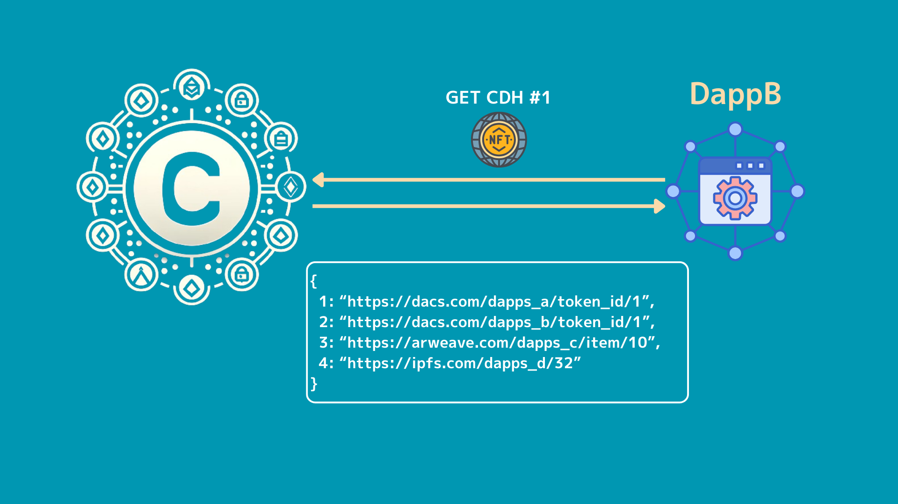

# CVCIP-1: Central Data Hub (CDH)

NFT to manage all data in one place.

## Abstract

NFT contract to manage all data in one place.
The Cross Value Chain can contain a variety of data in on-chain storage called "DACS".

[https://sustainable.cross.technology/jp/crosstech/technology](https://sustainable.cross.technology/jp/crosstech/technology)
[https://docs.crossvalue.io/whitepaper/dacs-node-architecture-and-sustainable-generation-manager](https://docs.crossvalue.io/whitepaper/dacs-node-architecture-and-sustainable-generation-manager)

This data can be tied to NFTs for management, so that NFT metadata (JSON) is stored.
This allows NFT holders and individual Dapps to freely change the metadata associated with the NFT.
The metadata stores the URLs of other data stored in "DACS", so that various data can be retrieved from the metadata associated with the NFT, such as saving the required data on specific Dapps or reading the data stored by other Dapps.
In addition, **ERC6551** can be used to tie a Token Bound Account (TBA) to an NFT, allowing the NFT to hold other NFTs, FTs and native tokens.
This allows the CDH to play the role of a data centre, for example by enabling mutual access between Dapps.

## Motivation

The metadata of most NFTs used in Ethereum and elsewhere contain only limited data, such as "name", "description" and "image".
Some NFTs are free to customise their metadata, but they are only aware of the marketplaces, such as Opensea, and do not make full use of the metadata.

[https://docs.opensea.io/docs/metadata-standards](https://docs.opensea.io/docs/metadata-standards)

This metadata can be extended to define a variety of fields, thus broadening the use of NFT.
The Cross Value Chain natively supports "DACS" on-chain storage as part of the chain, so a variety of data can be placed here.
Details on how to access this data could not be read from the documentation, but we believe it can probably be accessed via a URL or similar.
By defining multiple data in metadata using the key-value method, where the URL is the value and the field name is the key, it is possible to manage various data in the metadata.

For example, suppose there are **Dapps_A** and **Dapps_B\***.
When the address connected to each of these Dapps is the same, the metadata associated with the CDH NFT associated with that address is stored in "DACS".
By adding the fields "Dapps_A" and "Dapps_B" in the CDH metadata, it is possible to retrieve data from the respective Dapps via the CDH.

```json
{
  "Dapps_A": "https://dacs.com/dapps_a/token_id/1",
  "Dapps_B": "https://dacs.com/dapps_b/token_id/10"
}
```

It also facilitates interaction between Dapps by allowing **Dapps_A** to access data from **Dapps_B** and **Dapps_B** to access data from **Dapps_A**.
In this way, the various Dapps use the CDH as a hub for exchanging data, making the chain more active and enjoyable for participating users and enabling developers to build a wider variety of applications.


## Specification

### Field registration

First, each Dapps or BCG platform needs to register a field.
The image is like the Ethereum chain ID, where a unique field ID is assigned, such as "`1`: "CDH", `2`: "CDN""".
This allows you to register fields for use in each Dapps and BCG, so that when you add data to the CDH NFT metadata, you can see which Dapps and BCG each field ID is used for.


By storing it in the contract, a unique number can be tied to Dapps and BCGs.
In the case of Ethereum chain IDs, they are managed off-chain, so chain IDs can clash.
(e.g. Astar's Shibuya testnet and Japan Open Chain's chain ID were the same).
CDH can solve this conflict problem by managing with contracts.
Updates to registered field information can only be performed from the registered address.

### Adding data.

Only the holder of the NFT, or an address authorised by the holder, can add or update metadata.
The procedure for adding and updating is as follows.

1. send the field (number) and value to be added to the metadata, the `tokenId` and the signature of the address to the CDH contract.
2. verify the signature and check the holder and operator information of the relevant `tokenId` in the CDH contract, and check whether the executing address is authorised to add or update the data
3. after the authorisation is confirmed, update the metadata from off-chain.


The "DACS" URL associated with each field ID contains the data used by each Dapps and BCG.


Within the metadata associated with each NFT, various fields are defined, the values of which are all URLs to data stored within DACS.
The data is located at the destination of this URL.



The overall structure is that, firstly, metadata linked to the NFT is stored in DACS, which contains each field ID and URLs for DACS, IPFS, Arweave, etc.
Then, at the end of that URL, the data used by each Dapps and BCG is stored.
This configuration makes it possible to update the data used by each Dapps and BCG without changing the URLs in the metadata directly linked to the NFT.


### ERC6551

ERC6551 is used to tie NFT data to CDHs.
The ERC6551 creates Token Bound Accounts (TBAs) on NFTs in ERC721 format, which can receive other NFTs, FTs and native tokens tied one-to-one to the NFT.
This makes it possible to link and manage various on-chain data, not only data stored in DACS.


### Metadata Field

When storing data in metadata, field names are managed numerically, as is the EVM Chain ID.

```bash
{
	1: Dapp_A,
	2: Dapp_B
	...
}
```

The earlier the numbers are acquired, the better, and once acquired, fields can only be renamed from the registered address.

### ICDH

CDH-enabled contracts MUST implement the following interfaces

```solidity
interface ICDH {
	// =============================================================
	//                           ERROR
	// =============================================================

	error NotTokenOwnerOrPermitted(uint256 tokenId);
	error UnauthorizedCaller();
	error MetadataAlreadyExists(uint256 tokenId, uint256 fieldNumber);
	error MetadataDoesNotExist(uint256 tokenId, uint256 fieldNumber);
	error FieldNameAlreadyExists(uint256 fieldNumber);
	error FieldNameDoesNotExist(uint256 fieldNumber);
	error NotFieldOwner(
		uint256 fieldNumber,
		address invalidOwner,
		address fieldOwner
	);
	error InvalidFieldName(string fieldName);
	error AlreadyOwnsNFT(address owner);
	error SoulboundToken();

	// =============================================================
	//                           EVENT
	// =============================================================

	event EditorPermissionChanged(
		uint256 indexed tokenId,
		address indexed editor,
		bool permission
	);
	event MetadataAdded(
		uint256 indexed tokenId,
		uint256 fieldNumber,
		string fieldValue
	);
	event MetadataUpdated(
		uint256 indexed tokenId,
		uint256 fieldNumber,
		string newValue
	);

	// =============================================================
	//                         STRUCT
	// =============================================================

	struct Field {
		string name;
		uint256 number;
		address owner;
	}

	// =============================================================
	//                         EXTERNAL WRITE
	// =============================================================

	function safeMint(address to, string calldata uri) external;

	function setPermittedEditor(
		uint256 tokenId,
		address editor,
		uint256 fieldNumber,
		bool permission
	) external;

	function addMetadata(
		uint256 tokenId,
		uint256 fieldNumber,
		string calldata fieldValue
	) external;

	function updateMetadata(
		uint256 tokenId,
		uint256 fieldNumber,
		string calldata newValue
	) external;

	function registerFieldName(
		uint256 fieldNumber,
		string calldata fieldName
	) external;

	function updateFieldName(
		uint256 fieldNumber,
		string calldata newFieldName
	) external;

	// =============================================================
	//                         EXTERNAL VIEW
	// =============================================================

	function getMetadata(
		uint256 tokenId,
		uint256 fieldNumber
	) external view returns (string memory);

	function tokenURI(uint256 tokenId) external view returns (string memory);

	function metadatas(
		uint256 tokenId,
		uint256 fieldId
	) external view returns (string memory);

	function permittedEditors(
		uint256 tokenId,
		address editor,
		uint256 fieldId
	) external view returns (bool);

	function fieldNames(uint256 fieldId) external view returns (string memory);

	function fieldOwners(uint256 fieldId) external view returns (address);

	function tokenMetadatas(
		uint256 tokenId
	) external view returns (string memory);

	function eoaToTokenId(address eoa) external view returns (uint256);

	function tokenIdToTbaAccount(uint256 tokenId) external view returns (address);

	function eoaToTbaAccount(address eoa) external view returns (address);
}
```

#### setPermittedEditor

This function allows the owner of an NFT to grant permission to add and update metadata to other addresses.
This function can be used, for example, to grant permission to add metadata to the address of a Dapps operation.
Permission to add and update can be set for each field.

#### addMetadata

Function to add a new field to the metadata of an NFT.
Can only be executed by the owner of the NFT or an authorised address.
If the value already exists, `revert`.

#### updateMetadata

Function to update fields in the metadata of the NFT.
Can only be performed by the owner of the NFT or an authorised address.
If the value does not exist, `revert`.

#### getMetadata

Function to retrieve a specific field of metadata.

#### registerFieldName

Function to add a new field name.
The earlier the better, and once a field has been retrieved, only the address from which it was retrieved can be renamed, etc.

#### updateFieldName

Function to rename a configured field name.
You can rename fields that are associated with numbers.
Only the address where the field name was set can be updated.

#### tokenMetadatas

Function to retrieve metadata associated with a token id.

#### eoaToTokenId

Function to retrieve the token id of the NFT held from the EOA address.

#### tokenIdToTbaAccount

Function to retrieve the TBA account associated with an NFT from the NFT's token id.

#### eoaToTbaAccount

Function to retrieve the TBA account associated with the NFT held by the EOA address from the EOA address.

## Rationale

### Changing IPFS data.

IPFS is given a unique CID once it is uploaded.
To change the data afterwards, it has to be uploaded again and the CID is changed.
In other words, the metadata cannot be changed.
I don't know how it works in DACS, but there are mechanisms like variable references in IPFS.

[https://docs.ipfs.tech/concepts/file-systems/#mutable-file-system-mfs](https://docs.ipfs.tech/concepts/file-systems/#mutable-file -system-mfs)

By using this mechanism, instead of accessing the content directly, it can act as a Gateway by intermediating at a specific URL.
By changing the content at that destination, data can be changed in a flexible manner.

A similar mechanism also exists on Arweave.
A product called Iris provides exactly the same mechanism.

[https://docs.irys.xyz/developer-docs/mutable-references](https://docs.irys.xyz/developer-docs/mutable-references)

### Accessing DACS from the contract

The current design assumes that DACS cannot be accessed from the contract, and that the data is updated off-chain primarily.
Initially, the design assumes that DACS data will be stored on IPFS or similar.
If the DACS can be accessed from the contract, we are considering inscribing metadata on-chain.
Managing metadata directly from the contract is also done in Ethereum.
In the case of Cross Value Chain, the gas cost is not a major concern because of the low gas cost and the fact that the gas cost is incurred when registering DACS and IPFS URLs in CDH.
Also, data capacity is not a problem unless a significant amount of data is stored, as the data used in Dapps and BCGs is not that large.

### Delete Metadata Field.

Metadata Field names are tied to numbers, and these can only be updated with field names from the earliest and registered address.
We considered deleting the field from the registered address, but if the field is added by another registrant, the data that already exists in the metadata in use could be tied to the field registered by another registrant.
This could lead to vulnerability, so deletion is not possible.

### Any URL can be tied to it.

There are many distributed storage options, such as IPFS and Arweave.
"DACS" as well as the URLs of such distributed storage can be stored as values, so they can be used in an extensible way.


~~### Either the type of fieldName is of type `uint` or `string`~~

~~The type of fieldName is currently a `string`, but we are considering changing it to a `uint` type as it is easy to make mistakes when retrieving data.
If we change to the `uint` type, we need to keep track of which values are associated with which fields.
Managing them in a separate mapping array makes them easier to access and ensures that the data is managed properly.~~

### Integration with Name Service

~~When a Name Service like ENS is created on the Cross Value Chain, we are also considering linking to that Name Service.~~
~~We are trying to provide wider access, for example by enabling data to be retrieved in a way that is tied to a specific Name Service.~~

In conjunction with CDNs, addresses can be associated with human-identifiable names.

[CDN](https://github.com/mashharuki/CDN/tree/main)

Only one CDH can be owned per address.
This allows you to manage all the information associated with that address, but it can be difficult to remember the address name.
As address poisoning and other forms of address poisoning are prevalent, it is desirable to give the address a name that is easy to identify.
What is useful here is a service called Name Service, which ties an easily identifiable name to an address.
Name services called CDNs exist on CROSS VALUE CHAIN, so CDH can be used more easily in conjunction with these services.

### Price it or not

We are considering putting a per-address price on NFT's Mint.
Cross Value Chain is cheap, so if you have a lot of addresses, you can only issue so many of them.
There is no limit to the number of NFTs that can be issued, so issuing unlimited NFTs is not a problem.
However, you may need to pay for the creation of communities or other mechanisms in the future.
Putting a price on the Mint of the NFT will allow sales here to be used for future updates.

### SBT or...

It is natural that this NFT cannot `transfer`, as it is tied to an address.
The ability to `transfer` increases the range of what can be done, but may also reduce security, e.g. due to incorrect `approve` of a `transfer`.

## Reference Implementation

[CDH.sol](../src/contract/packages/hardhat/contracts/CDH.sol)

## Security Considerations

### Ability to switch values in metadata.

The value of each field in the metadata can only be changed by the holder of the NFT or an authorised address.
However, changes made here may affect the Dapps in use.

## Copyright

Copyright and related rights waived via CC0.

## Citation

Please cite this document as:

Cardene([@cardene777](https://github.com/cardene777))
