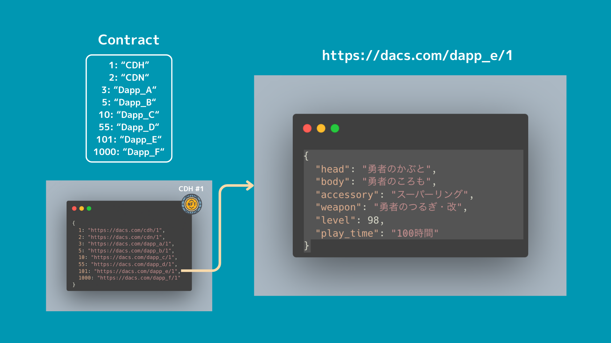
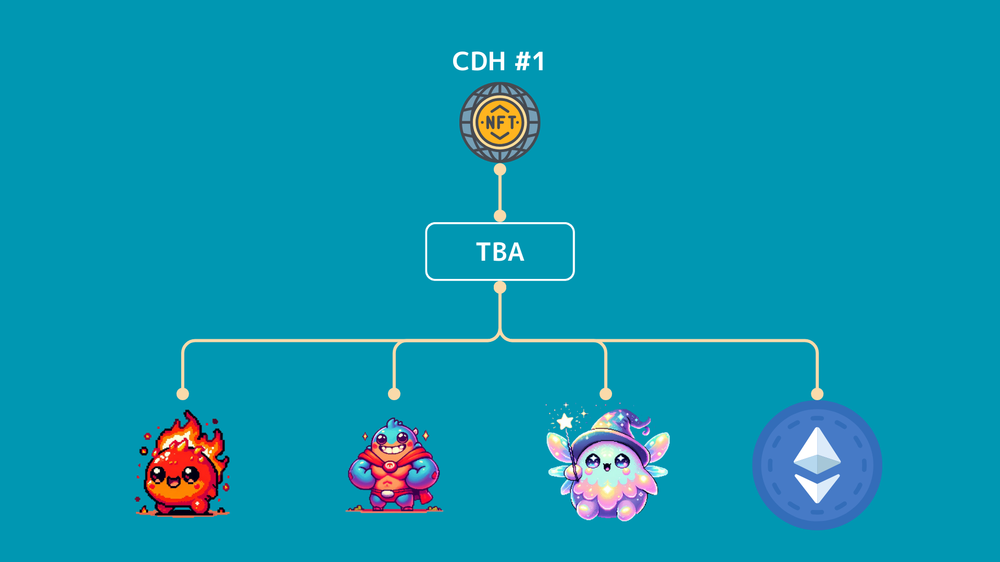

# CVCIP-1: Central Data Hub (CDH)

あらゆるデータを一括管理する NFT

## Abstract

あらゆるデータを一括管理する NFT コントラクトです。
Cross Value Chain には"DACS"と呼ばれるオンチェーンストレージに様々なデータを載せることができます。

[https://sustainable.cross.technology/jp/crosstech/technology](https://sustainable.cross.technology/jp/crosstech/technology)
[https://docs.crossvalue.io/whitepaper/dacs-node-architecture-and-sustainable-generation-manager](https://docs.crossvalue.io/whitepaper/dacs-node-architecture-and-sustainable-generation-manager)

このデータは NFT に紐づいて管理ができるため、NFTのメタデータ（JSON）を保存します。
これにより、NFT 保有者や各Dappsから自由にNFTに紐づいたメタデータを変更することができます。
メタデータには"DACS"に保存されている他のデータの URL を保存し、特定のDapps上で必要なデータを保存したり、他のDappsによって保存されたデータを読み取るなどしてNFTに紐づくメタデータからさまざまなデータを取得できます。
また、**ERC6551**を使用して、NFTにTBA（Token Bound Account）を紐づけることで、NFTが他のNFTやFT、ネイティブトークンを保有することができます。
これにより Dapps間で相互にアクセスが可能になるなどデータの中心地の役割を CDH が果たします。

## Motivation

Ethereum などで使用されているほとんどのNFTのメタデータには、"name", "description", "image"など、限られたデータしか格納されていません。
NFTによっては自由にメタデータをカスタムしているが、Opensea などのマーケットプレイスなどへの対応のみに意識がいきメタデータを活用しきれていません。

[https://docs.opensea.io/docs/metadata-standards](https://docs.opensea.io/docs/metadata-standards)

このメタデータを拡張し、様々なフィールドを定義するようにすることで、NFT の活用の幅が広がります。
Cross Value Chain ではチェーンとして、ネイティブにオンチェーンストレージである"DACS"をサポートしているため、ここに様々なデータを載せることができます。
このデータにアクセスする方法の詳細はドキュメントから読み取ることができませんでしたが、おそらく URL などでアクセスできると考えています。
この URL を値（value）に、フィールド名をキー（key）にしたkey-value方式でデータをメタデータ内に複数定義することで、メタデータで様々なデータを管理することができるようになります。

例えば、**Dapps_A** と **Dapps_B** があるとします。
この各 Dapps に接続したアドレスが同じである時、そのアドレスに紐づいたCDH NFTに紐づいたメタデータが"DACS"に保存されています。
CDH のメタデータ内に「"Dapps_A"」と「"Dapps_B"」というフィールドを追加して、それぞれの Dapps から CDH を経由してデータを取得することが可能になります。

```json
{
  "Dapps_A": "https://dacs.com/dapps_a/token_id/1",
  "Dapps_B": "https://dacs.com/dapps_b/token_id/10"
}
```

また、**Dapps_A** から **Dapps_B** のデータにアクセスしたり、**Dapps_B** から **Dapps_A** のデータにアクセスしたりすることも可能になり、Dapps 間の相互作用が促進されます。
このように、様々な Dapps が CDH をハブにしてデータをやり取りすることで、チェーンが活発になり参加ユーザーが楽しめるとともに、開発者がより多彩なアプリケーションを構築できるようになります。


## Specification

### フィールド登録

まずは、各DappsやBCGプラットフォームがフィールド登録する必要があります。
EthereumのチェーンIDのように「`1`: "CDH", `2`: "CDN"」のようにユニークなフィールドIDが割り当てられるイメージです。
これにより、各DappsやBCGで使用するためのフィールドを登録でき、CDH NFTのメタデータにデータを追加した時に、各フィールドIDがどのDappsやBCGで使用されているデータかを確認できるようにないます。


コントラクトに保存することで、一意の番号をDappsやBCGに紐づけることができます。
EthereumのチェーンIDの場合あくまでオフチェーンで管理しているため、チェーンIDがぶつかってしまうことがあります。
（AstarのShibuyaテストネットとJapan Open ChainのチェーンIDが同じになってしまっていたことなど）
CDHではコントラクトで管理することで、この競合問題を解消できます。
登録したフィールド情報の更新は、登録したアドレスからのみ実行できます。

### データの追加

NFT の保有者、もしくは保有者によって許可を与えられたアドレスのみがメタデータを追加・更新できます。
追加・更新の手順は以下になります。

1. メタデータに追加したいフィールド（番号）と値、`tokenId`、アドレスの署名を CDH コントラクトに送る。
2. 署名の検証とCDH コントラクトで該当の`tokenId`の保有者及びoperator情報を確認し、実行アドレスにデータの追加・更新権限があるかをチェック。
3. 権限の確認が取れたのち、オフチェーンからメタデータを更新する。


各フィールドIDに紐づく"DACS"のURLには、各DappsやBCGで使用されているデータが保存されいています。



各 NFT に紐づいているメタデータ内には、様々なフィールドが定義されていて、その値は全て DACS 内に保存されているデータへの URL になっています。
この URL の先にデータが存在する構成になっています。


全体の構成としては、まずNFTに紐づくメタデータが DACS 内に保存されていて、そのデータの中身は各フィールドIDと DACS や IPFS、Arweave などの URL が格納されています。
そして、その URL の先に各 Dapps や BCG で使用されるデータが格納されています。
この構成を取ることで、NFT に直接紐づくメタデータ内の URL を変更することなく、各 Dapps や BCG で使用するデータを更新することが可能になります。


### ERC6551

NFT のデータを CDH に紐づけるために、ERC6551 を使用します。
ERC6551 は ERC721 形式の NFT に TBA（Token Bound Accounts）というものを作成し、NFT に1対1で紐づいて他の NFTやFT、ネイティブトークンなどを受け取ることができます。
これにより、DACS に保存されているデータに限らず、様々なオンチェーンデータを紐付けて管理可能になります。



### Metadata Field

メタデータ内にデータを保存するときのフィールド名は EVM の Chain ID 同様、数字で管理します。

```bash
{
	1: Dapp_A,
	2: Dapp_B
	...
}
```

数字の取得は早い者勝ちで、一度取得したフィールドは登録したアドレスからのみフィールド名の変更が可能になります。

### ICDH

CDH に対応するコントラクトは以下のインターフェースを実装する必要があります（MUST）。

```solidity
interface ICDH {
	// =============================================================
	//                           ERROR
	// =============================================================

	error NotTokenOwnerOrPermitted(uint256 tokenId);
	error UnauthorizedCaller();
	error MetadataAlreadyExists(uint256 tokenId, uint256 fieldNumber);
	error MetadataDoesNotExist(uint256 tokenId, uint256 fieldNumber);
	error FieldNameAlreadyExists(uint256 fieldNumber);
	error FieldNameDoesNotExist(uint256 fieldNumber);
	error NotFieldOwner(
		uint256 fieldNumber,
		address invalidOwner,
		address fieldOwner
	);
	error InvalidFieldName(string fieldName);
	error AlreadyOwnsNFT(address owner);
	error SoulboundToken();

	// =============================================================
	//                           EVENT
	// =============================================================

	event EditorPermissionChanged(
		uint256 indexed tokenId,
		address indexed editor,
		bool permission
	);
	event MetadataAdded(
		uint256 indexed tokenId,
		uint256 fieldNumber,
		string fieldValue
	);
	event MetadataUpdated(
		uint256 indexed tokenId,
		uint256 fieldNumber,
		string newValue
	);

	// =============================================================
	//                         STRUCT
	// =============================================================

	struct Field {
		string name;
		uint256 number;
		address owner;
	}

	// =============================================================
	//                         EXTERNAL WRITE
	// =============================================================

	function safeMint(address to, string calldata uri) external;

	function setPermittedEditor(
		uint256 tokenId,
		address editor,
		uint256 fieldNumber,
		bool permission
	) external;

	function addMetadata(
		uint256 tokenId,
		uint256 fieldNumber,
		string calldata fieldValue
	) external;

	function updateMetadata(
		uint256 tokenId,
		uint256 fieldNumber,
		string calldata newValue
	) external;

	function registerFieldName(
		uint256 fieldNumber,
		string calldata fieldName
	) external;

	function updateFieldName(
		uint256 fieldNumber,
		string calldata newFieldName
	) external;

	// =============================================================
	//                         EXTERNAL VIEW
	// =============================================================

	function getMetadata(
		uint256 tokenId,
		uint256 fieldNumber
	) external view returns (string memory);

	function tokenURI(uint256 tokenId) external view returns (string memory);

	function metadatas(
		uint256 tokenId,
		uint256 fieldId
	) external view returns (string memory);

	function permittedEditors(
		uint256 tokenId,
		address editor,
		uint256 fieldId
	) external view returns (bool);

	function fieldNames(uint256 fieldId) external view returns (string memory);

	function fieldOwners(uint256 fieldId) external view returns (address);

	function tokenMetadatas(
		uint256 tokenId
	) external view returns (string memory);

	function eoaToTokenId(address eoa) external view returns (uint256);

	function tokenIdToTbaAccount(uint256 tokenId) external view returns (address);

	function eoaToTbaAccount(address eoa) external view returns (address);
}
```

#### setPermittedEditor

NFT の所有者がメタデータの追加・更新権限を他のアドレスに許可する関数です。
この関数を使用することで、例えば Dapps の運営のアドレスにメタデータを追加する許可を与えることができます。
各フィールドごとに追加・更新許可を設定できます。

#### addMetadata

NFT のメタデータにフィールドを新規追加する関数です。
NFT の所有者か許可されたアドレスのみ実行可能です。
すでに値が存在する場合は`revert`します。

#### updateMetadata

NFT のメタデータにフィールドを更新する関数です。
NFT の所有者か許可されたアドレスのみ実行可能です。
値が存在しない場合は`revert`します。

#### getMetadata

メタデータの特定のフィールドを取得する関数です。

#### registerFieldName

フィールド名を新規追加する関数です。
早い者勝ちで、一度取得されたフィールドは取得したアドレスのみ名前の変更などが可能です。

#### updateFieldName

設定したフィールド名の名前を変更する関数です。
数字に紐づいているフィールドの名前を変更できます。
更新できるのは、フィールド名を設定したアドレスのみです。

#### tokenMetadatas

token idに紐づくメタデータを取得する関数です。

#### eoaToTokenId

EOAアドレスから保有しているNFTのtoken idを取得する関数です。

#### tokenIdToTbaAccount

NFTのtoken idからNFTに紐づくTBAアカウントを取得する関数です。

#### eoaToTbaAccount

EOAアドレスが保有するNFTに紐づくTBAアカウントをEOAアドレスから取得する関数です。

## Rationale

### コントラクトからDACSにアクセスする

現状の設計では、コントラクトからDACSにアクセスできないことを前提に、オフチェーン主体でデータの更新を行います。
初期はDACSのデータの保存先もIPFSなどになると思うので、それを想定した設計になっています。
もし、コントラクトからDACSにアクセスできるようであれば、オンチェーンにメタデータを刻むことも考えています。
コントラクトから直接メタデータを管理することは Ethereum でも行われています。
ただ、更新のたびにガス代がかかったり、データ容量の問題があります。
Cross Value Chain の場合は、ガス代が無料という点と、DACS や IPFS の URL のみの保存になるため、そこまで容量がボトルネックになることはないと思っています。

### Metadata Field の削除

Metadata Field 名は数字に紐づき、これは早い者勝ちかつ登録したアドレスからのみフィールド名の更新が可能です。
登録したアドレスからフィールドの削除も考えましたが、別の登録者によってフィールドを追加されてしまうと、既に利用されているメタデータ内に存在するデータが別の登録者によって登録されたフィールドに紐づいてしまうことが考えられます。
これは脆弱性につながる恐れがあるため、削除はできないようにしています。

### URL ならば何でも紐付けられる

IPFS や Arweave など、分散型ストレージはたくさんあります。
"DACS"だけでなく、このような分散型ストレージの URL を値として保存することもできるため、拡張性高く使用できます。


~~### fieldName の型を`uint`型にするか~~

~~現在 fieldName の型は`string`型だが、データを取得するときに間違えが生じやすいため、`uint`型に変更することを考えています。
`uint`型に変更すると、どの値がどのフィールドに紐づいているかを管理する必要があります。
別の mapping 配列で管理することでアクセスしやすく、データを適切に管理できるようになります。~~

### Name Service との統合

Cross Value Chain 上に ENS のような Name Service が作成されたとき、その Name Service との連携も考えています。
特定の Name Service に紐づく形でデータを取得できるようにするなど、より幅広いアクセスを提供しようとしています。

### 価格をつけるか

NFT の Mint にあたり価格をつけるか検討しています。
Cross Value Chain はガス代が 0 なため、アドレスをたくさん用意すればその分だけ発行できてしまいます。
特に上限は設けないため、無制限に NFT を発行すること自体は問題ないです。
しかし、今後コミュニティなどを作成したり、他の仕組みなどを導入する際に費用が必要になるかもしれません。
NFT の Mint に価格をつけることで、ここでの売り上げが将来のアップデートに活用できるようになります。

### SBT にするか

この NFT はアドレスに紐づく形を取るため、transfer できない方が自然に思えます。
transfer ができることでできることの幅も広がりますが、誤った approve による transfer などセキュリティが下がることが考えられます。

## Reference Implementation

[CDH.sol](../src/contract/packages/hardhat/contracts/CDH.sol)

## Security Considerations

### メタデータ内の値を切り替える機能

メタデータ内の各フィールドの値は、NFT の保有者か許可されたアドレスのみ変更可能です。
ただ、ここを変更されることで、使用している Dapps に影響が出る可能性があります。

## Copyright

Copyright and related rights waived via CC0.

## Citation

Please cite this document as:

Cardene([@cardene777](https://github.com/cardene777))
